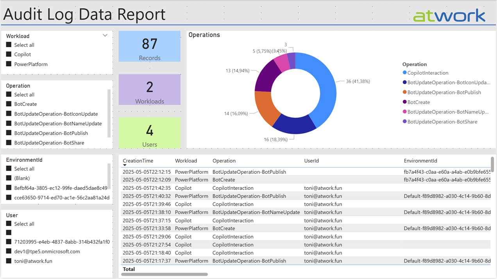

# Logic Apps helper

Logic Apps provide a great way to work with data for business processes.  
Find out more at https://docs.microsoft.com/en-us/azure/logic-apps/logic-apps-overview

## Sample Logic Apps

Here are some Logic Apps samples for use in governance scenarios.  
Discover a wealth of reports and business scenarios with our solution, [Governance Toolkit 365](https://governancetoolkit365.com/ ) (GT365). Whether you're looking to streamline operations, enhance compliance, or gain valuable insights, GT365 offers comprehensive tools and resources to meet your needs. Explore the possibilities and transform your governance strategy today!

- **CoE-Report-Flows.json:** Read flows as administrator from an environment and sends a list to a specified eail address.
- **Read-Guests.json:** Reads guest from an Azure Storage table and sends a list to the administrators per email.
- **Get-AuditLog-Data.json:** Read data about usage of Copilot and Power Platform events from the M365 Audit Log with an app and a secret and write it to an Azure Storage Account table. You can develop a Power BI dashboard from that data, as in the following sample screenshot.

## Helper expressions

Here are some general tips for expressions when working with Azure Logic Apps.  
Avoid errors when an item is null (not existing): Use [coalesce()](https://docs.microsoft.com/en-us/azure/logic-apps/workflow-definition-language-functions-reference#coalesce)

~~~~
coalesce(items('For_each')?['admin_displayname'],'','')
~~~~

These examples return the first non-null value from the specified values, or null when all the values are null:

~~~~
coalesce(null, true, false)
returns: **true**

coalesce(null, 'hello', 'world')
returns: **"hello"**

coalesce(null, null, null)
returns: **"null"**
~~~~

## Access an item in a loop

~~~~
items('For_each')
~~~~

Add any properties with the following syntax.

~~~~
items('For_each')?['admin_displayname']
items('For_each')?['value']?['admin_displayname']
~~~~

## Sample payload

Process data from Dataverse, e.g. into an array converted to an HTML table or similar.

~~~~json
{
"name": "@{coalesce(items('For_each')?['admin_displayname'],'','')}",
"id": "@{coalesce(items('For_each')?['admin_flowid'],'','')}",
"created": "@{coalesce(items('For_each')?['createdon'],'','')}",
"environment": "@{coalesce(items('For_each')?['admin_flowenvironmentdisplayname'],'','')}",
"description": "@{coalesce(items('For_each')?['admin_flowdescription'],'','')}"
}
~~~~
