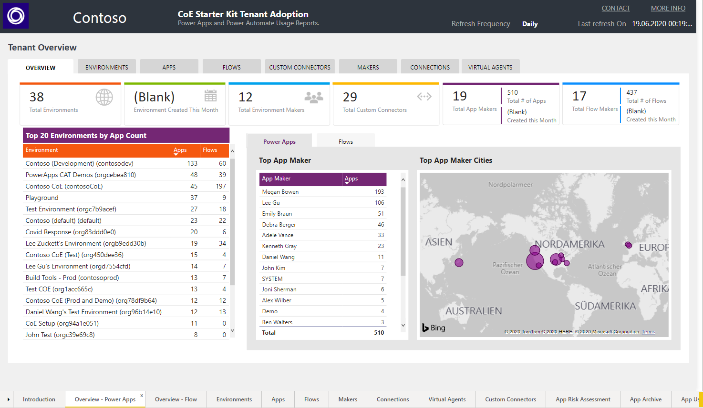
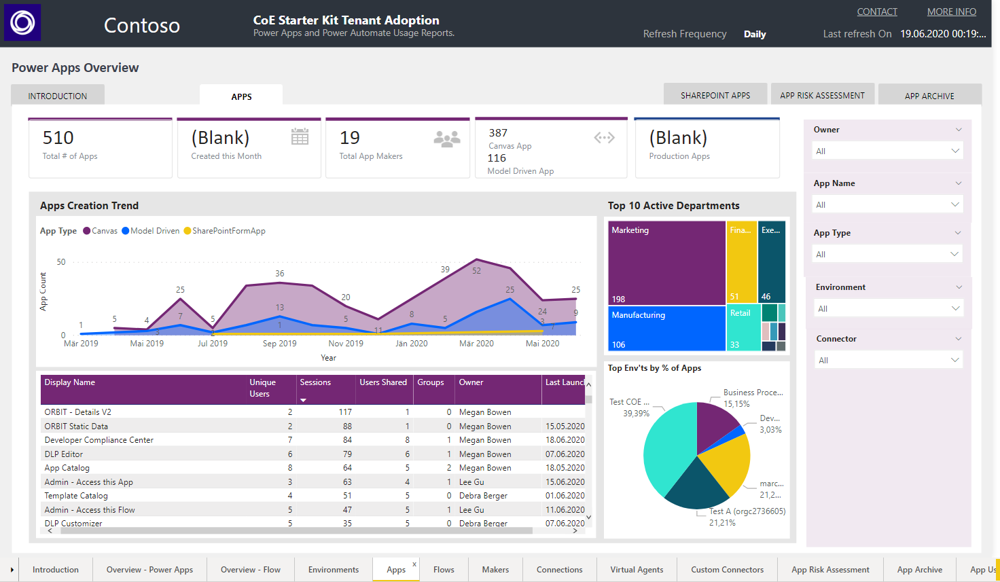

# Power Platform and Copilot Governance

IT Governance helps to to monitor and control key information technology and processes in an organization. This repository contains presentations and helpful information to control your power platform components in your Microsoft 365 tenant. This repository is a joint project from [Peter Hödl](https://www.linkedin.com/in/peter-h%C3%B6dl/), [Martina Grom](https://www.linkedin.com/in/martinagrom/), [Toni Pohl](https://www.linkedin.com/in/tonipohl/), and [Christoph Wilfing](https://www.linkedin.com/in/christoph-wilfing-27983258/) from [atwork.at](https://www.atwork-it.com/) and will be extended from time to time with additional information and tools for automating governance tasks in the Microsoft 365 platform.

## Administration of the Power Platform

- Microsoft Power Platform Admin Center: [aka.ms/ppac](https://aka.ms/ppac)
- Activate the Unified Audit Log in your tenant: [aka.ms/Security-and-Compliance](https://aka.ms/Security-and-Compliance). See more at https://docs.microsoft.com/en-us/microsoft-365/compliance/search-the-audit-log-in-security-and-compliance. **Note:** It can take up to 30 minutes or up to 24 hours after an event occurs for the corresponding audit log record to be returned in the results of an audit log search.

## Backup and Restore Flows

Find a Backup1Flow and Restore1Flow in the [Flows](./Flows) directory. These flows allow to create a backup of a flow to a SharePoint document library and to restore the saved flow in the same environment if needed with the restore flow. For more information, see the article at [blog.atwork.at](https://blog.atwork.at/post/backup-and-restore-a-flow-with-another-flow).  

## Use PowerShell for Power Apps, Power Automate, and more

Note: Earlier, the Power Platform modules required Windows PowerShell version 5.x. This is no longer required, now PowerShell Core 7.x is supported as well. To check the version of the PowerShell version, and for working with PowerShell modules, see (./powershell/ReadMe.md).

See more at https://docs.microsoft.com/en-us/powershell/powerapps/get-started-powerapps-checker?view=pa-ps-latest

**Note:** To automate, such PowerShell scripts can be executed in Microsoft Azure in an Azure Automation Account environment.

## Use PowerShell for Power BI

The Power BI modules run in Windows PowerShell and in PowerShell core 7.x. You can install them from the PowerShell Gallery.

~~~powershell
# Install the modules from the PowerShell Gallery
Install-Module -Name MicrosoftPowerBIMgmt -Scope CurrentUser
~~~

**Note:** To automate, such PowerShell scripts can be executed in Microsoft Azure in an Azure Automation Account , or in an Azure Function v3 environment.

**Access with SPN:** Power BI also supports authentication with a Service principal to let a Microsoft Entra application access Microsoft Fabric content and APIs. The app must not have any admin-consent required permissions for Power BI set on it in the Azure portal. Service principals can access the /admin APIs in a read-only mode if enabled, such as https://api.powerbi.com/v1.0/myorg/admin/[method]. Follow the steps described at [Enable service principal authentication for read-only admin APIs](https://learn.microsoft.com/en-us/fabric/admin/) and the available endpoints at [Power BI REST APIs - Admin](https://learn.microsoft.com/en-us/rest/api/power-bi/admin). Find out more in the [Power BI developer documentation](https://learn.microsoft.com/en-us/power-bi/developer/).  

## Center of Excellence (CoE)

The CoE allows to monitor and react on activities in the Microsoft Power Platform: "The Microsoft Power Platform CoE Starter Kit is a collection of components and tools that are designed to help you get started with developing a strategy for adopting and supporting Microsoft Power Platform, with a focus on Power Apps and Power Automate." It´s a helpful tool for your governance projects.

A part of the CoE solution includes Power BI dashbards, as here.

There is a lot of information about the components included, such as a list of all apps.

...and much more. Give it a try.

- Install the  CoE starter kit: [aka.ms/coestarterkit](aka.ms/coestarterkit)
- Download the CoE starter kit: [aka.ms/coestarterkitdownload](aka.ms/coestarterkitdownload)
- See and get the latest releases: (https://github.com/microsoft/coe-starter-kit/releases)

## Develop a Power App

- See the helpful formula help: [Formula reference for Power Apps](https://docs.microsoft.com/en-us/powerapps/maker/canvas-apps/formula-reference)
  
## Develop a custom connector

- See [Get started with Swashbuckle and ASP.NET Core](https://docs.microsoft.com/en-us/aspnet/core/tutorials/getting-started-with-swashbuckle?view=aspnetcore-3.1&tabs=visual-studio)
- [Create and deploy an ASP.NET web app to Azure](https://docs.microsoft.com/en-us/connectors/custom-connectors/create-web-api-connector#create-and-deploy-an-aspnet-web-app-to-azure)
- See this blog post series from Patrick Lamber at [Describe-Your-Custom-Connector-With-An-Swagger](https://www.nubo.eu/Describe-Your-Custom-Connector-With-An-Swagger/)

## Copilot Agents

We are now in the transformative era of AI and M365 Copilot, where technology seamlessly integrates into our daily tasks. Discover some resources available to enhance your experience here.

- [Technical Readiness guide](https://aka.ms/Copilot/TechnicalReadinessGuide)
- [Set up Microsoft 365 Copilot](https://setup.cloud.microsoft/microsoft-365-copilot/setup-guide)
- Create your own agents with no code and start at [copilotstudio.microsoft.com](https://copilotstudio.microsoft.com/)
- [Microsoft Copilot Scenario Library ](https://adoption.microsoft.com/copilot-scenario-library/)
- [Microsoft Copilot Scenario PPT Library downloads](https://transform.microsoft.com/copilot-scenarios)
- [Copilot Scenario Library downloads](https://adoption.microsoft.com/copilot-scenario-library/downloads/)
- [Microsoft 365 Copilot | Copilot Studio agent builder](https://www.youtube.com/watch?v=uo-vCFL96yQ)
- [Securing data in an AI-first world with Microsoft Purview](https://techcommunity.microsoft.com/blog/securitycopilotblog/securing-data-in-an-ai-first-world-with-microsoft-purview/3981279)

## More

- Develop your own governance processes with automation, using PowerShell or APIs
- Check out our [GovernanceToolkit365.com](https://governancetoolkit365.com/) (GT365)
- Check out other tools such as the [Power Studio for the Power Platform](https://flowstudio.app/) from our MVP colleague John Liu

We hope the resources here help for your M365 governance journey.
